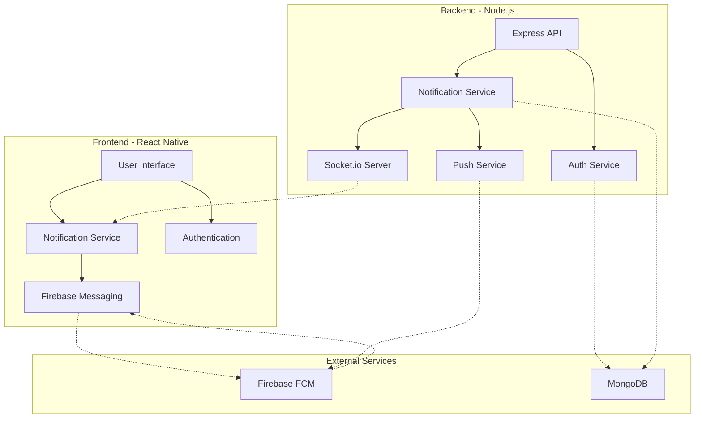
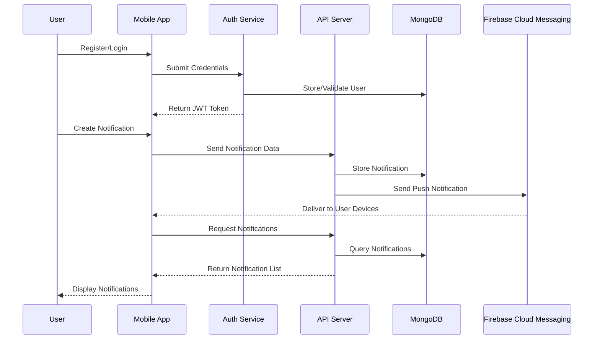
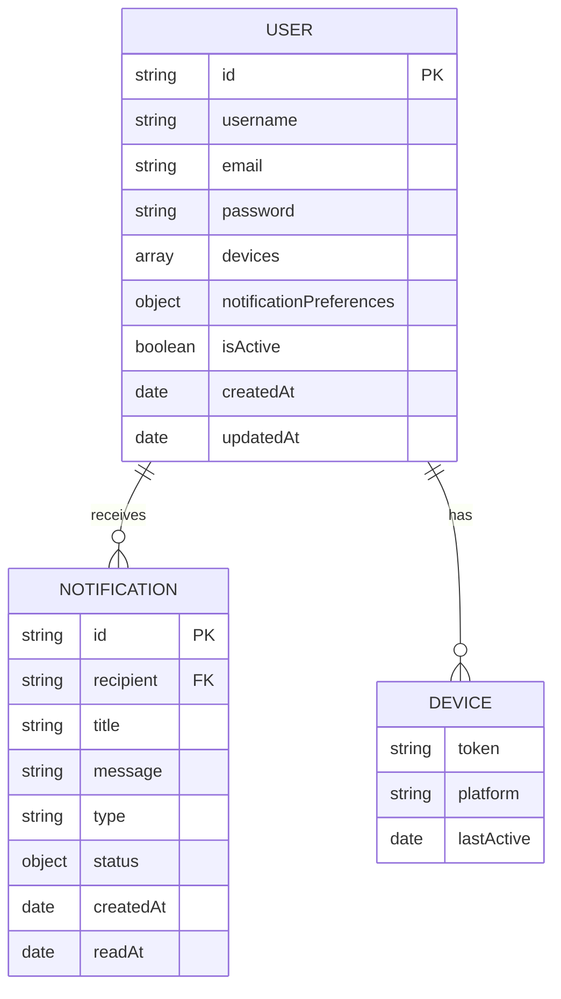

# NotifyMe - Real-time Notification App

A full-stack mobile application built with React Native and Node.js that delivers real-time notifications through multiple channels. The app demonstrates a complete notification system with in-app notifications, push notifications via Firebase Cloud Messaging (FCM), and secure user authentication.


## 📱 Features

- **User Authentication**: Secure register and login flow with JWT token-based authentication
- **In-App Notifications**: Create and display notifications within the application interface
- **Push Notifications**: Real-time push notifications using Firebase Cloud Messaging
- **Real-time Updates**: Socket-based instant notification delivery
- **User Preferences**: Granular control over notification settings and preferences
- **Multiple Notification Channels**: Support for mobile push, in-app, and email notifications
- **Notification History**: Complete notification history with read/unread status

## 🏗️ System Architecture



## 💾 Data Flow



## 🛠️ Tech Stack

- **Frontend**:
  - React Native (Core framework)
  - Firebase Cloud Messaging (Push notifications)
  - AsyncStorage (Local data persistence)
  - Socket.io Client (Real-time communications)

- **Backend**:
  - Node.js & Express.js (API server)
  - Socket.io (Real-time updates)
  - MongoDB (Database)
  - JWT (Authentication)
  - Firebase Admin SDK (Push notifications)

- **DevOps**:
  - Git & GitHub (Version control)
  - Docker (Containerization)

## 📊 Database Schema



## 🏢 Project Structure

```
notifyme/
├── android/               # Android native code
├── ios/                   # iOS native code
├── src/                   # React Native source code
│   ├── services/          # API and service integrations
│   │   └── notificationService.js  # FCM and notification handling
│   └── components/        # UI components
├── backend/               # Node.js backend
│   ├── config/            # Configuration files
│   ├── middleware/        # Express middleware
│   ├── models/            # MongoDB models
│   ├── routes/            # API routes
│   ├── services/          # Business logic
│   └── utils/             # Utilities
└── docs/                  # Documentation
```

## 🚀 Getting Started

### Prerequisites

- Node.js 14+
- MongoDB
- Firebase project with FCM enabled
- React Native development environment

### Installation

1. Clone the repository:
   ```bash
   git clone https://github.com/ALOK-Yeager/notifyme.git
   cd notifyme
   ```

2. Install dependencies:
   ```bash
   npm install
   cd backend && npm install && cd ..
   ```

3. Configure environment variables:
   ```bash
   cp .env.example .env
   cp backend/.env.example backend/.env
   # Edit the .env files with your configuration
   ```

4. Start the backend server:
   ```bash
   cd backend && node index.js
   ```

5. Start the React Native app:
   ```bash
   npx react-native start
   npx react-native run-android  # or run-ios
   ```

## 🔧 API Endpoints

| Method | Endpoint                  | Description                    | Auth Required |
|--------|---------------------------|--------------------------------|--------------|
| POST   | `/api/auth/register`      | Register a new user            | No           |
| POST   | `/api/auth/login`         | Authenticate a user            | No           |
| GET    | `/api/notifications`      | Get user's notifications       | Yes          |
| POST   | `/api/notifications`      | Create a new notification      | Yes          |
| PATCH  | `/api/notifications/:id/read` | Mark notification as read  | Yes          |
| POST   | `/api/notifications/push-test` | Test push notification    | Yes          |

## 📱 Screenshots

<div style="display: flex; justify-content: space-between;">
    
    
    
</div>

## 🔒 Environment Variables

### Backend

```env
# Server Configuration
PORT=3000
NODE_ENV=development

# Database
MONGODB_URI=mongodb://localhost:27017/notification-system

# Authentication
JWT_SECRET=your-jwt-secret
JWT_EXPIRE=7d

# Firebase Admin SDK
FIREBASE_PROJECT_ID=your-project-id
FIREBASE_CLIENT_EMAIL=your-client-email
FIREBASE_PRIVATE_KEY=your-private-key
```

### Frontend

```env
BACKEND_URL=http://localhost:3000
```

## 📈 Future Enhancements

- [ ] Email notification channel
- [ ] Schedule-based notifications
- [ ] Advanced notification analytics
- [ ] Admin dashboard for notification management
- [ ] Multi-language support

## 📄 License

This project is licensed under the MIT License - see the LICENSE file for details.

## 👥 Contributors

- [Your Name](https://github.com/ALOK-Yeager) - Initial work and maintenance

## Step 1: Start Metro

First, you will need to run **Metro**, the JavaScript build tool for React Native.

To start the Metro dev server, run the following command from the root of your React Native project:

```sh
# Using npm
npm start

# OR using Yarn
yarn start
```

## Step 2: Build and run your app

With Metro running, open a new terminal window/pane from the root of your React Native project, and use one of the following commands to build and run your Android or iOS app:

### Android

```sh
# Using npm
npm run android

# OR using Yarn
yarn android
```

### iOS

For iOS, remember to install CocoaPods dependencies (this only needs to be run on first clone or after updating native deps).

The first time you create a new project, run the Ruby bundler to install CocoaPods itself:

```sh
bundle install
```

Then, and every time you update your native dependencies, run:

```sh
bundle exec pod install
```

For more information, please visit [CocoaPods Getting Started guide](https://guides.cocoapods.org/using/getting-started.html).

```sh
# Using npm
npm run ios

# OR using Yarn
yarn ios
```

If everything is set up correctly, you should see your new app running in the Android Emulator, iOS Simulator, or your connected device.

This is one way to run your app — you can also build it directly from Android Studio or Xcode.

## Step 3: Modify your app

Now that you have successfully run the app, let's make changes!

Open `App.tsx` in your text editor of choice and make some changes. When you save, your app will automatically update and reflect these changes — this is powered by [Fast Refresh](https://reactnative.dev/docs/fast-refresh).

When you want to forcefully reload, for example to reset the state of your app, you can perform a full reload:

- **Android**: Press the <kbd>R</kbd> key twice or select **"Reload"** from the **Dev Menu**, accessed via <kbd>Ctrl</kbd> + <kbd>M</kbd> (Windows/Linux) or <kbd>Cmd ⌘</kbd> + <kbd>M</kbd> (macOS).
- **iOS**: Press <kbd>R</kbd> in iOS Simulator.

## Congratulations! :tada:

You've successfully run and modified your React Native App. :partying_face:

### Now what?

- If you want to add this new React Native code to an existing application, check out the [Integration guide](https://reactnative.dev/docs/integration-with-existing-apps).
- If you're curious to learn more about React Native, check out the [docs](https://reactnative.dev/docs/getting-started).

# Troubleshooting

If you're having issues getting the above steps to work, see the [Troubleshooting](https://reactnative.dev/docs/troubleshooting) page.

# Learn More

To learn more about React Native, take a look at the following resources:

- [React Native Website](https://reactnative.dev) - learn more about React Native.
- [Getting Started](https://reactnative.dev/docs/environment-setup) - an **overview** of React Native and how setup your environment.
- [Learn the Basics](https://reactnative.dev/docs/getting-started) - a **guided tour** of the React Native **basics**.
- [Blog](https://reactnative.dev/blog) - read the latest official React Native **Blog** posts.
- [`@facebook/react-native`](https://github.com/facebook/react-native) - the Open Source; GitHub **repository** for React Native
