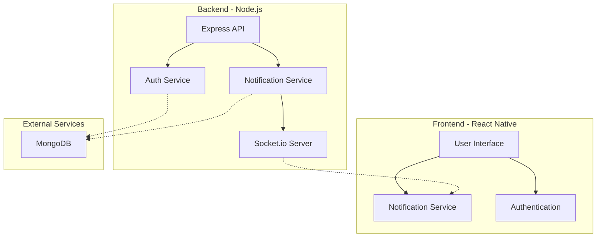
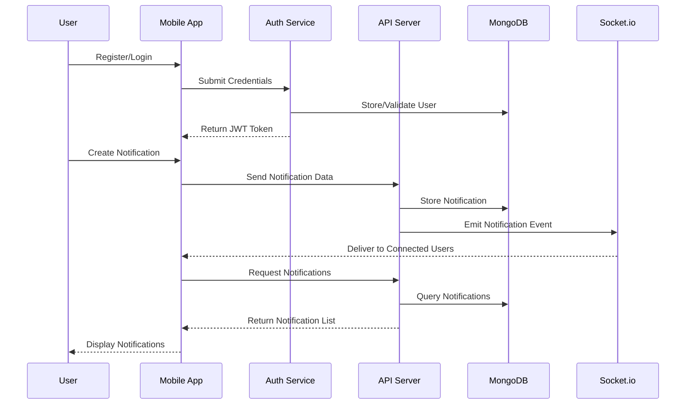
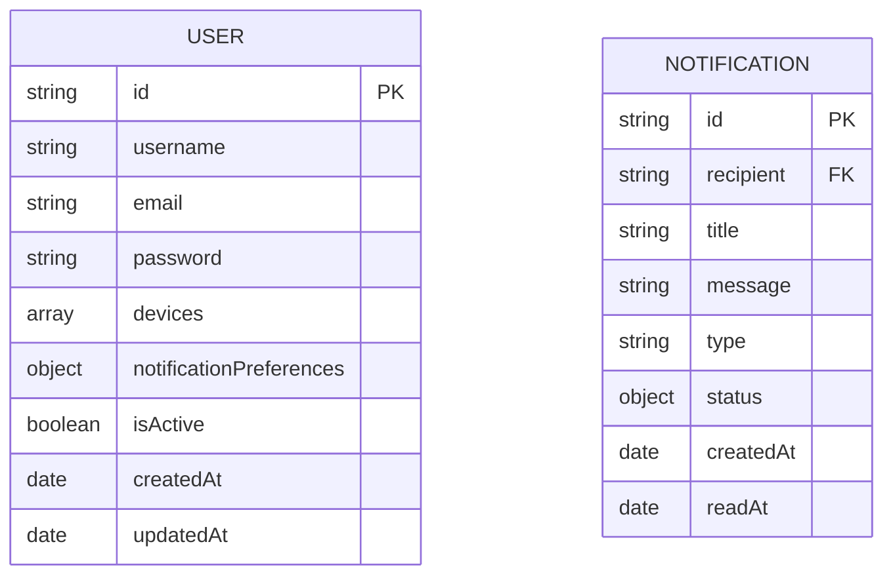

# NotifyMe - Real-time Notification System

A full-stack mobile application built with React Native and Node.js that provides real-time notifications via Socket.io. This app demonstrates a complete notification system with in-app notifications, user authentication, and notification management.

## 📱 Features

- **User Authentication**: Secure register and login flow with JWT token-based authentication
- **Real-time Notifications**: Receive notifications in real-time when the app is open
- **Notification History**: View all past notifications in a chronological feed
- **Read/Unread Status**: Track which notifications have been viewed
- **Socket.io Integration**: Real-time bidirectional communication
- **User Preferences**: Granular control over notification settings and preferences

## 🏗️ System Architecture



## 💾 Data Flow



## 🛠️ Tech Stack

- **Frontend**:
  - React Native (Core framework)
  - Socket.io Client (Real-time communications)
  - Axios (HTTP requests)
  - AsyncStorage (Local data persistence)

- **Backend**:
  - Node.js & Express.js (API server)
  - Socket.io (Real-time updates)
  - MongoDB (Database)
  - JWT (Authentication)

- **DevOps**:
  - Git & GitHub (Version control)
  - Docker (Containerization)

## 📊 Database Schema



## Installation

### Prerequisites
- Node.js (v14+)
- MongoDB
- React Native development environment
- Android Studio / Xcode

### Backend Setup
1. Navigate to the backend directory:
   ```
   cd backend
   ```

2. Install dependencies:
   ```
   npm install
   ```

3. Create a `.env` file with the following variables:
   ```
   NODE_ENV=development
   PORT=3000
   MONGODB_URI=mongodb://localhost:27017/notifyme
   JWT_SECRET=your_jwt_secret
   JWT_EXPIRE=30d
   ```

4. Start the server:
   ```
   npm start
   ```

### Frontend Setup
1. Install dependencies in the root directory:
   ```
   npm install
   ```

2. For Android, set up port forwarding:
   ```
   adb reverse tcp:3000 tcp:3000
   adb reverse tcp:8081 tcp:8081
   ```

3. Start the Metro bundler:
   ```
   npm start
   ```

4. Run on Android:
   ```
   npm run android
   ```

## Testing

Several test scripts are included to validate functionality:

1. Test socket-based notifications:
   ```
   node test-notification.js
   ```

2. Test backend connection:
   ```
   node test-backend-connection.js
   ```

## Known Limitations

Please see [LIMITATIONS.md](./LIMITATIONS.md) for a detailed breakdown of known issues and planned improvements.

## License

This project is licensed under the MIT License.

## 👥 Contributors

- [ALOK-Yeager](https://github.com/ALOK-Yeager) - Initial work and maintenance
